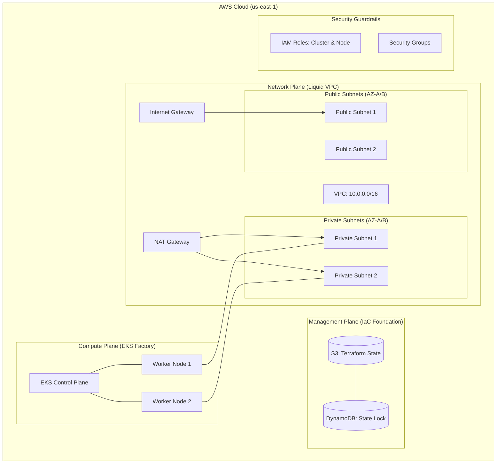
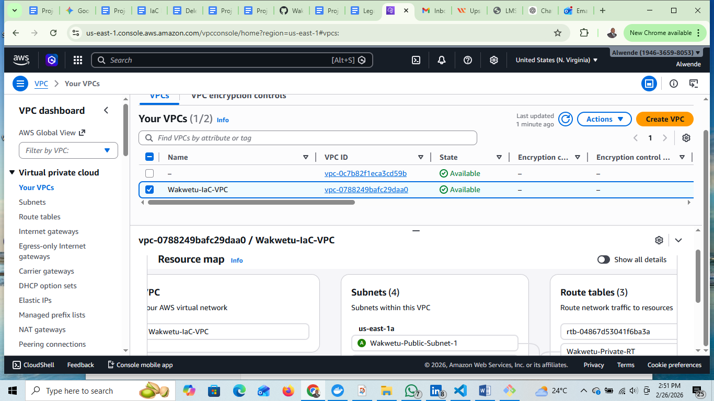
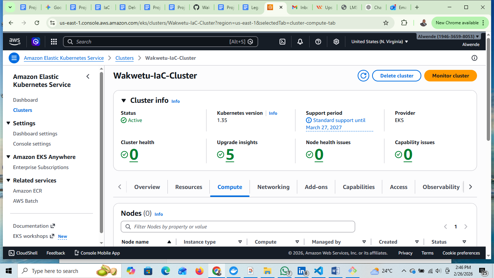
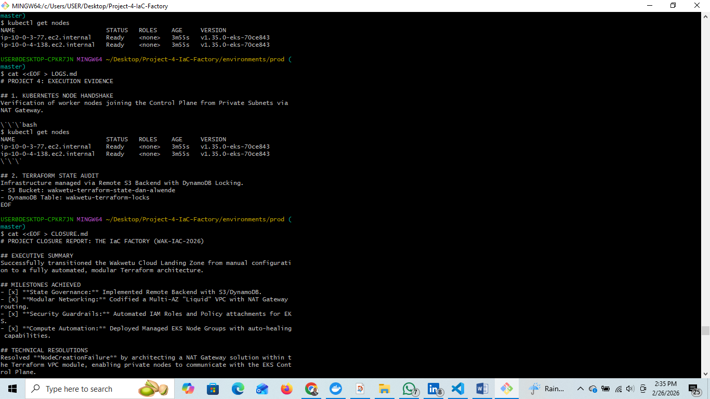
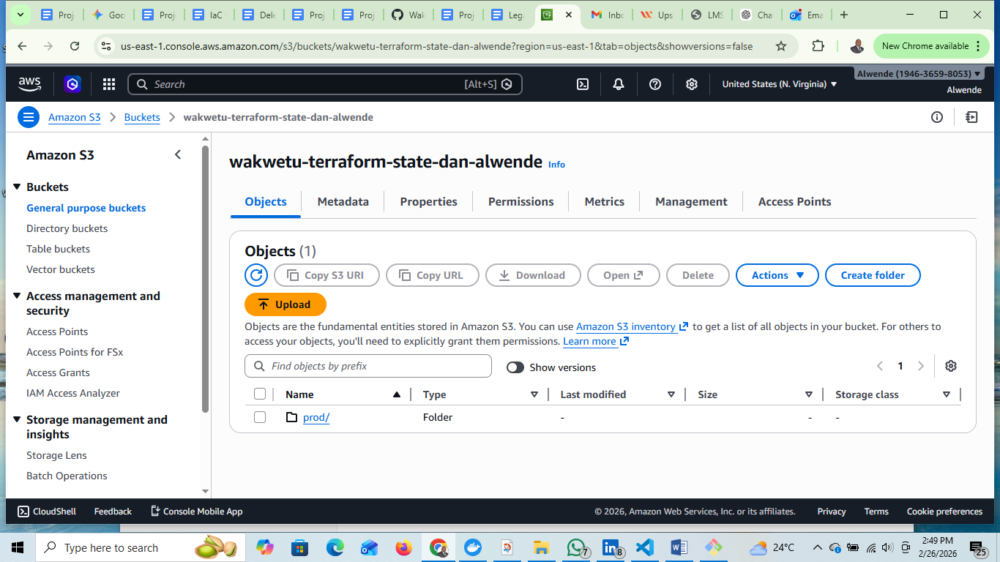

# WAKWETU CLOUD FACTORY: Automated Enterprise Landing Zone

## PROJECT OVERVIEW
This project transitions the **Wakwetu Cloud Infrastructure** from manual, console-driven deployments to a fully automated **Infrastructure-as-Code (IaC)** model using **Terraform**. 

By codifying the environment, we eliminate configuration drift, enhance security via modular guardrails, and ensure 100% repeatability across regions.

## ARCHITECTURAL STANDARDS (The PMP Bar)
- **Immutability:** Zero manual changes in the AWS Console. 
- **Governance:** Remote State Management using **Amazon S3** and **DynamoDB** (State Locking).
- **Security-by-Design:** Private-tier EKS nodes with outbound-only internet access via **NAT Gateway**.
- **Modularity:** Reusable VPC, Security, and EKS modules.


## REPOSITORY STRUCTURE
- `bootstrap/`: Sets up the S3/DynamoDB Backend (The Foundation).
- `modules/`: Reusable architectural blueprints (VPC, Security, EKS).
- `environments/prod/`: The live implementation "wiring" and remote state config.

## KEY ACHIEVEMENTS
1. **Resolved Node Handshake Failure:** Diagnosed and remediated EKS Node Group registration issues by architecting a NAT Gateway solution within the VPC module.
2. **Brownfield Integration:** Successfully imported existing IAM roles into Terraform management without service interruption.

## TECHNICAL VERIFICATION
Verification of worker nodes successfully joining the Control Plane from Private Subnets:
```bash
$ kubectl get nodes
NAME                         STATUS   ROLES    AGE     VERSION
ip-10-0-3-77.ec2.internal    Ready    <none>   3m55s   v1.35.0-eks-70ce843
ip-10-0-4-138.ec2.internal   Ready    <none>   3m55s   v1.35.0-eks-70ce843
```

**LEAD ARCHITECT:** Dan Alwende, PMP

## ARCHITECTURAL DESIGN (HLD)
The following diagram represents the automated Wakwetu Landing Zone.



## PROJECT EVIDENCE (THE PROOF)
### 1. Networking & VPC Topology


### 2. Managed EKS Cluster Status


### 3. Kubernetes Node Readiness


### 4. Remote State Governance (S3)

